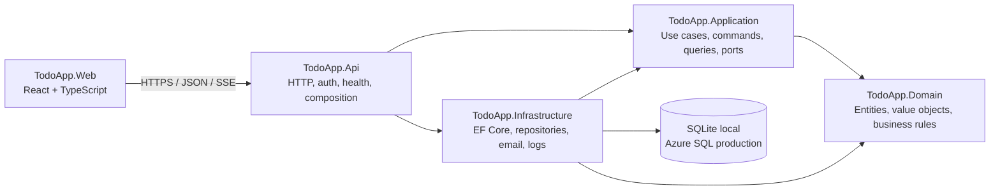

# Taskora

Taskora is a workspace-based task and project delivery platform built with
.NET, C#, React, TypeScript, and Entity Framework Core. It started as a todo
project, but now demonstrates a portfolio-ready modular monolith with
workspaces, projects, tasks, assignment, reporting, reminders, operations
monitoring, and CI/CD.

The repository keeps the internal solution name as `TodoApp` while the
user-facing product name is `Taskora`.

## What It Does

- Workspace management with owner, manager, and member roles.
- User registration, login, profile update, password update, and logout.
- Workspace invitations for new or existing users through secure invite links.
- Workspace switching so cards, board, list, reports, projects, members, and
  notifications only show data for the selected workspace.
- Project CRUD with required delivery dates, archive rules, delivery countdowns,
  and project-level health indicators.
- Tasks created under active projects only.
- Task workflow: Backlog, Ready, In Progress, Blocked, and Completed.
- Drag-and-drop board with guarded workflow rules and assignment awareness.
- Task list with search, filtering, sorting, pagination, created date, due date,
  score, status, assignee, tags, and actions.
- Task assignment to workspace members, including automatic pickup of
  unassigned Ready work when a member moves it to In Progress.
- Priority scoring from business value, urgency, risk reduction, and effort.
- Due dates, overdue detection, reminder notifications, and dashboard warnings.
- Categories, tags, and task notes with writer name and timestamp.
- Personal Todo page for daily private work with CRUD, search, pagination,
  complete/reopen, mobile layout, and automatic carry-over after midnight.
- Dashboard cards, charts, project health, risk register, decision log, release
  readiness, activity, and reports.
- In-app notifications and SMTP-backed email notifications.
- Super-admin-only Operations page for API health, database health, scheduler
  status, log settings, and recent application logs.
- Seed/demo data mode for portfolio walkthroughs.
- Azure DevOps pipeline for restore, build, tests, frontend build, migrations,
  packaging, and optional deployment.

## Architecture

Taskora uses a modular monolith with clean dependency direction. This gives the
project a production-style structure without adding microservice complexity too
early.



### Why This Architecture

- The domain layer keeps business rules independent from ASP.NET Core, React,
  EF Core, and deployment concerns.
- The application layer models real use cases such as creating tasks, assigning
  work, inviting members, generating reports, and sending reminders.
- Infrastructure can be swapped or tested behind interfaces.
- The API stays focused on HTTP contracts, validation, authentication,
  authorization, and composition.
- The React app remains a separate client that consumes the API instead of
  reaching into server internals.
- It is easy to run locally, easy to deploy, and still shows professional
  separation of concerns.

## Solution Structure

```text
src/
├── TodoApp.Api             HTTP API, auth, health checks, SSE, startup
├── TodoApp.Application     Commands, queries, DTOs, ports, use cases
├── TodoApp.Domain          Entities, value objects, domain rules, events
├── TodoApp.Infrastructure  EF Core, repositories, email, logging, seed data
└── TodoApp.Web             React + TypeScript frontend

tests/
├── TodoApp.Domain.Tests
├── TodoApp.Application.Tests
├── TodoApp.Infrastructure.Tests
└── TodoApp.Api.IntegrationTests
```

## Key Product Workflows

### Workspaces and Members

When a user registers, Taskora can create a default workspace and make that user
the owner. Owners and managers can invite members, manage workspace membership,
and create projects. Members can work only inside workspaces they belong to.

Invites are not limited to existing accounts. The invite flow can accept an
email address, create the user account when needed, and send onboarding details
through email when SMTP is enabled.

### Projects and Tasks

Projects represent delivery containers. A task must belong to an active project
before it can be created. This keeps work tied to real delivery outcomes instead
of becoming a loose global todo list.

Workspace owners and managers can create and manage projects. Members can view
project context and work on assigned or available tasks.

### Task Workflow

- `Backlog`: captured work that is not ready to start.
- `Ready`: refined work available for pickup or assignment.
- `In Progress`: work currently being handled by an assigned member.
- `Blocked`: work paused because something is preventing progress.
- `Completed`: finished work.

If an unassigned Ready task is moved to In Progress by a workspace member, the
system assigns that task to the member. Assigned tasks cannot be picked up by
another member without the correct permissions.

### Priority Intelligence

Task priority is calculated from:

- Business value
- Urgency
- Risk reduction
- Effort

This makes the score explainable instead of arbitrary. High value, urgent,
risk-reducing, lower-effort tasks naturally rise higher.

### Notes, Tags, and Categories

Categories group tasks by work type, such as Backend, Frontend, QA, Research,
Bug, Feature, Documentation, or Support. Tags are lighter labels such as
`frontend`, `urgent`, `blocked-by-api`, `client-review`, or `quick-win`.

Task notes are used for updates, decisions, blockers, and handover context.
Each note shows the writer and timestamp.

### Personal Todo

The Todo page is for a user's own daily checklist. It is separate from project
tasks. Incomplete todos can automatically carry over after midnight and show a
carry-over badge with the original date.

## Realtime and Notifications

Taskora uses server-sent events where available so workspace changes can update
the UI without a full page refresh. The frontend also uses silent refresh
patterns so board and dashboard updates do not blank the page during normal
work.

Notifications include:

- In-app notification feed.
- Task assignment notifications.
- Due-date reminders two days before, 24 hours before, and on the due date.
- Project delivery-date reminders.
- Dashboard warnings for overdue, blocked, or at-risk work.
- SMTP email delivery when configured.

## Operations

Health and operations features are designed for deployment support:

- `/health/live` checks whether the API process is running.
- `/health/ready` checks whether the app is ready to serve traffic.
- `/health` provides a general health endpoint.
- Super-admin-only Operations page shows API, database, reminder scheduler,
  logging configuration, and recent application log entries.
- Logs are retained according to `Operations__Logs__RetentionDays`.
- Super-admin access is configured through
  `Administration__SuperAdminEmails__0`.

## Testing

The project follows TDD for core behaviour and uses focused tests at each layer:

- Domain tests for task lifecycle, priority scoring, dependencies, projects,
  dates, effort, and business rules.
- Application tests for commands, queries, authorization paths, reports,
  reminders, workspace access, and typed results.
- Infrastructure tests for EF Core mappings, repositories, migrations,
  persistence, seed data, and logs.
- API integration tests for routes, validation, authentication, authorization,
  Problem Details, health checks, and end-to-end API behaviour.
- Frontend build and tests are part of the pipeline when Node/npm are available.

Run backend validation:

```powershell
dotnet restore TodoApp.sln
dotnet build TodoApp.sln --configuration Release
dotnet test TodoApp.sln --configuration Release --no-build
```

Run frontend validation from `src/TodoApp.Web`:

```powershell
npm install
npm run build
```

## Local Setup

Copy the environment template:

```powershell
Copy-Item .env.example .env
```

For local development, SQLite is the simplest database:

```text
Database__Provider=Sqlite
ConnectionStrings__TodoApp=Data Source=todoapp.db
Database__ApplyMigrationsOnStartup=true
DemoData__SeedOnStartup=true
```

Start the API:

```powershell
dotnet run --project src/TodoApp.Api/TodoApp.Api.csproj --launch-profile http
```

Start the web app:

```powershell
cd src/TodoApp.Web
npm install
npm run dev
```

Default local URLs:

```text
API: http://localhost:5080
Web: http://localhost:5173
```

Demo account when demo data is enabled:

```text
jadesola@example.com
Portfolio123!
```

## Environment Configuration

Use `.env` locally and Azure App Service application settings in production.
Do not commit `.env`.

Important settings:

```text
App__PublicBaseUrl=https://your-frontend-host

Database__Provider=SqlServer
ConnectionStrings__TodoApp=Server=...;Database=...;...
Database__ApplyMigrationsOnStartup=false

DemoData__SeedOnStartup=false

Authentication__Authority=https://your-token-issuer
Authentication__Audience=todoapp-api
Cors__AllowedOrigins__0=https://your-frontend-host

Administration__SuperAdminEmails__0=you@example.com

Notifications__Scheduler__Enabled=true
Notifications__Scheduler__IntervalMinutes=1440

Operations__Logs__RetentionDays=30
Operations__Logs__MaxEntries=200

Email__Smtp__Enabled=true
Email__Smtp__Host=smtp.example.com
Email__Smtp__Port=587
Email__Smtp__UseSsl=true
Email__Smtp__Username=your-smtp-username
Email__Smtp__Password=your-smtp-password
Email__Smtp__FromAddress=no-reply@example.com
Email__Smtp__FromName=Taskora
```

## Database and Migrations

Restore the repository-pinned EF tool:

```powershell
dotnet tool restore
```

Apply local migrations:

```powershell
dotnet tool run dotnet-ef database update `
  --project src/TodoApp.Infrastructure/TodoApp.Infrastructure.csproj `
  --startup-project src/TodoApp.Api/TodoApp.Api.csproj
```

For production, prefer an idempotent SQL migration script reviewed before
deployment:

```powershell
dotnet tool run dotnet-ef migrations script --idempotent `
  --project src/TodoApp.Infrastructure/TodoApp.Infrastructure.csproj `
  --startup-project src/TodoApp.Api/TodoApp.Api.csproj `
  --output database/migrations.sql
```

## CI/CD

`azure-pipelines.yml` is configured for Azure DevOps and portfolio deployment.
The pipeline covers:

- .NET SDK setup
- Node.js setup
- frontend package restore
- frontend build
- NuGet restore
- solution build
- backend tests
- coverage publishing
- EF Core migration script generation
- API/web publish artifact
- optional Docker artifact
- optional Azure App Service deployment
- optional smoke test

Branches are intended to follow:

```text
feature/* -> dev -> main
```

Feature branches should be tested through pull requests before merging into
`dev`. `main` should represent deployable code.

## Azure Deployment Notes

For a low-cost portfolio deployment:

- Start with Azure App Service F1 Free for the API when possible.
- Keep deployments manual until the pipeline is proven.
- Use budget alerts in Azure.
- Use real SMTP credentials only through App Service application settings.
- Use Azure SQL or another managed SQL database when persistent production data
  is required.
- Keep Docker optional if the target environment does not need it yet.

See:

- [Azure setup checklist](docs/AZURE_SETUP.md)
- [Operations runbook](docs/OPERATIONS.md)
- [Testing strategy](docs/TESTING.md)
- [Architecture notes](docs/ARCHITECTURE.md)
- [Roadmap and milestones](docs/ROADMAP.md)

## Security Checklist

- `.env` is ignored by Git.
- Secrets are supplied through environment variables or Azure settings.
- Passwords are stored as PBKDF2 hashes.
- Tokens expire and production JWT settings must be configured.
- CORS is restricted outside local development.
- Role checks are enforced in the backend, not only hidden in the UI.
- Super-admin operations are gated by configured email address.
- SMTP can be disabled locally and enabled in production.
- Health endpoints support deployment checks.

## Portfolio Highlights

Taskora demonstrates more than a basic todo list:

- Domain-driven modelling with tested business rules.
- TDD across domain and application behaviour.
- Clean use-case boundaries with commands, queries, and ports.
- Real collaboration model with workspaces, roles, invites, and assignment.
- Professional delivery features: reports, health, risks, readiness, activity,
  reminders, notifications, and operational monitoring.
- Full-stack React + .NET implementation with CI/CD and deployment guidance.

Developed by [salisu.dev](https://salisu.dev). Copyright 2026.
