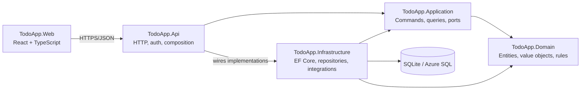

# TodoApp

A priority-intelligence task management application built with C# and .NET.
Its production REST API helps users manage projects and rank work using value,
urgency, risk, effort, and task dependencies.

## Project Documentation

- [Product roadmap](docs/ROADMAP.md)
- [Product requirements](docs/REQUIREMENTS.md)
- [Architecture](docs/ARCHITECTURE.md)
- [Testing strategy](docs/TESTING.md)
- [Contribution workflow](docs/CONTRIBUTING.md)
- [Operations runbook](docs/OPERATIONS.md)
- [Detailed milestones](docs/ROADMAP.md#detailed-milestones)

Development follows incremental delivery, TDD for core behaviour, and a
modular monolith architecture. The product is delivered through nine
milestones covering planning, business rules, application workflows, data,
HTTP APIs, product intelligence, user experience, security, and operations.

## Delivery Milestones

| Milestone | Status | Outcome |
| --- | --- | --- |
| 0. Planning and Baseline | Complete | Requirements, architecture, testing strategy, contribution workflow, and initial CI |
| 1. Domain Foundation | Complete | Tested task lifecycle, projects, dependencies, scheduling, priority rules, and domain events |
| 2. Application Use Cases | Complete | Commands, queries, application ports, typed results, filtering, sorting, and pagination |
| 3. Persistence | Complete | EF Core, SQLite development database, Azure SQL configuration, migrations, and repositories |
| 4. Production REST API | Complete | Versioned endpoints, validation, Problem Details, OpenAPI, health checks, and integration tests |
| 5. Priority Intelligence | Complete | Explainable prioritisation, deadline health, blocker analysis, activity history, and dashboards |
| 6. Web Experience | Complete | Responsive React and TypeScript dashboard, task list, Kanban board, and frontend tests |
| 7. Identity and Collaboration | Complete | Authentication, workspaces, membership, assignments, roles, and authorization |
| 8. Delivery and Operations | In progress | Docker, Azure CI/CD, deployment environments, observability, runbooks, and portfolio evidence |

Each milestone has measurable acceptance criteria, required tests, a definition
of done, and an expected commit sequence in the
[product roadmap](docs/ROADMAP.md).

## Architecture



The project uses a **modular monolith with domain-oriented boundaries**:

- It keeps deployment and local development simple for one product.
- Business rules remain independent of ASP.NET Core, EF Core, and React.
- Application interfaces make infrastructure replaceable and testable.
- Separate projects enforce dependency direction at compile time.
- It demonstrates production architecture without the operational overhead of
  premature microservices.
- Modules can be extracted later if scale or team ownership provides a real
  reason.

`TodoApp.Api` is the composition root. HTTP contracts stay separate from
domain entities and invoke application use cases backed by Infrastructure.

## Current Development

Milestones 1 through 7 are complete on feature branches. The current
`feature/identity-collaboration` branch includes:

- A guarded task lifecycle from Backlog to Completed.
- Blocking, unblocking, and reopening rules.
- Task dependencies with circular-reference protection.
- Automatic detection of work blocked by incomplete dependencies.
- Explainable priority scoring using value, urgency, risk reduction, and effort.
- Project creation, editing, target dates, and archive restrictions.
- Due-date and Fibonacci effort-estimate value objects.
- Domain events for task lifecycle changes.
- Create, start, complete, and dependency application commands.
- Task detail and filtered paginated search queries.
- Task editing, workflow, planning, scheduling, and dependency maintenance.
- Project create, update, archive, details, and delivery-board use cases.
- Architecture dependency tests.
- EF Core mappings, repositories, migrations, concurrency, and seed data.
- SQLite local persistence and Azure SQL provider configuration.
- Versioned project, board, task, lifecycle, planning, and dependency routes.
- Consistent Problem Details for validation, not-found, conflict, malformed,
  and unexpected failures.
- OpenAPI discovery, correlation IDs, and separate live/ready health checks.
- Explainable priority recommendations and deadline health.
- Stable priority tie-breakers and incomplete dependency-chain guidance.
- Immutable activity history and project/portfolio intelligence dashboards.
- Responsive React list and Kanban views with task editing and planning.
- Component and desktop/mobile browser tests.
- JWT authentication with development/test identity isolation.
- Workspace roles, guarded membership, and task assignment.
- Server-side security tests for unauthorized and forbidden access.
- 68 domain, 34 application, 17 Infrastructure, and 12 API integration tests.

Run the complete build and test suite with:

```powershell
dotnet build TodoApp.sln --configuration Release
dotnet test TodoApp.sln --configuration Release --no-build
```

Restore the repository-pinned EF tool and apply local migrations with:

```powershell
dotnet tool restore
dotnet tool run dotnet-ef database update `
  --project src/TodoApp.Infrastructure/TodoApp.Infrastructure.csproj `
  --startup-project src/TodoApp.Infrastructure/TodoApp.Infrastructure.csproj
```

## Run Locally

Install the .NET SDK, then run:

```bash
dotnet restore TodoApp.sln
dotnet run --project src/TodoApp.Api/TodoApp.Api.csproj
```

The development API runs at:

```text
http://localhost:5080
```

You can test the API from `TodoApp.http` in VS Code with the REST Client extension.

## Example Requests

Create a project:

```http
POST http://localhost:5080/api/v1/projects
Content-Type: application/json

{
  "name": "Portfolio launch",
  "description": "Deliver a production-ready portfolio"
}
```

Create a task:

```http
POST http://localhost:5080/api/v1/projects/{projectId}/tasks
Content-Type: application/json

{
  "title": "Review Azure pipeline",
  "effort": 3
}
```

## Push To GitHub

Install Git first if the `git` command is not available.

```bash
git init
git add .
git commit -m "Create simple todo API"
git branch -M main
git remote add origin https://github.com/YOUR-USERNAME/TodoApp.git
git push -u origin main
```

Replace `YOUR-USERNAME` with your GitHub username.

## Azure DevOps CI Pipeline

This repository includes `azure-pipelines.yml`. It does the following when code is pushed to `main`, `dev`, or a feature branch:

- Installs the .NET SDK.
- Installs Node.js.
- Restores frontend packages.
- Runs frontend component tests.
- Builds the React frontend.
- Restores NuGet packages.
- Builds the .NET solution.
- Runs backend tests and publishes coverage.
- Publishes the app as a build artifact named `drop`.
- Builds and publishes a Docker image artifact.
- Optionally deploys the artifact to Azure App Service.
- Optionally runs a deployment smoke test.

To connect it in Azure DevOps:

1. Create a project in Azure DevOps.
2. Go to **Pipelines**.
3. Select **New pipeline**.
4. Select **GitHub** as the code source.
5. Authorize Azure DevOps to access your GitHub repository.
6. Select this repository.
7. Choose **Existing Azure Pipelines YAML file**.
8. Select `/azure-pipelines.yml`.
9. Run the pipeline.

## Optional Deployment

After the CI pipeline works, you can enable the deployment stage. You will need:

- An Azure subscription.
- An App Service already created.
- An Azure DevOps service connection.
- The App Service name.

Then update these variables in `azure-pipelines.yml`:

```yaml
azureServiceConnection: YOUR-AZURE-SERVICE-CONNECTION
webAppName: YOUR-AZURE-WEB-APP-NAME
smokeTestBaseUrl: https://YOUR-AZURE-WEB-APP-NAME.azurewebsites.net
```

When you manually run the pipeline, set `Deploy to Azure App Service` to `true`.
See the [operations runbook](docs/OPERATIONS.md) for release, smoke-test, and
rollback steps.
