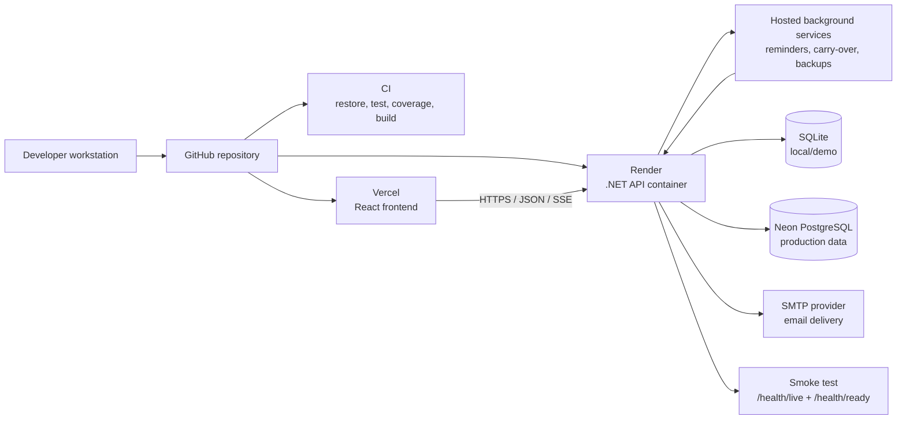

# Operations Runbook

## Purpose

This runbook explains how Taskora is built, packaged, deployed, validated, and
rolled back. The preferred portfolio deployment is Vercel for the React
frontend, Render for the .NET API container, and Neon PostgreSQL for persistent
data.

## Release Flow

1. Open a feature branch from the latest accepted development branch.
2. Run the local checks before opening a pull request.
3. Let CI restore, test, build, and package the application.
4. Review the pipeline artifacts and test coverage.
5. Merge only after CI is green.
6. Deploy the frontend from Vercel and the API from Render.
7. Run the smoke test against the deployed Render API URL.

## Deployment Architecture



## Background Services

Taskora runs scheduled work inside the Render API container as ASP.NET Core
hosted services:

- `DueDateReminderScheduler` runs on
  `Notifications__Scheduler__IntervalMinutes`. It sends task due-date
  reminders, project delivery-date reminders, and personal todo carry-over
  summaries.
- `DatabaseBackupScheduler` runs on `Operations__Backups__IntervalHours`. It
  creates backup files, exposes them on the super-admin Database Backups page,
  and prunes files older than `Operations__Backups__RetentionDays`.

The My Day endpoint also has a fallback carry-over path. If a user opens My Day
before the scheduler runs, unfinished personal todos are carried into the
current business day and the same email summary is sent.

Carry-over uses the configured business timezone:

```text
App__TimeZoneId=Europe/London
```

This avoids depending on the cloud server's physical region or UTC date when
deciding when a new business day begins.

## Local Verification

```powershell
dotnet restore Taskora.sln
dotnet build Taskora.sln --configuration Release --no-restore
dotnet test Taskora.sln --configuration Release --no-build --collect:"XPlat Code Coverage"

Push-Location src/Taskora.Web
npm ci
npm run test
npm run build
Pop-Location

docker build -t taskora:local .
```

Docker can be skipped on machines where it is not installed. CI still contains
the Docker build step so container readiness can be validated later.

## Environment Configuration

| Setting | Purpose | Secret |
| --- | --- | --- |
| `ConnectionStrings__TodoApp` | Database connection string | Yes |
| `Database__Provider` | `Sqlite` for local or `Postgres` for Neon | No |
| `Authentication__Mode` | `AppToken` for portfolio auth or `Jwt` for external identity | No |
| `Authentication__Authority` | JWT issuer authority when using external identity | No |
| `Authentication__Audience` | Expected audience for app tokens or JWT | No |
| `App__PublicBaseUrl` | Public frontend URL used in email links | No |
| `App__TimeZoneId` | Business timezone for carry-over and date-sensitive jobs | No |
| `Operations__Logs__FileEnabled` | Enables JSONL log file output | No |
| `Operations__Logs__Directory` | Folder for daily `taskora-*.jsonl` files | No |
| `Email__Smtp__Enabled` | Enables real SMTP email delivery when `true` | No |
| `Email__Smtp__Host` | SMTP server hostname | No |
| `Email__Smtp__Port` | SMTP server port, usually `587` | No |
| `Email__Smtp__UseSsl` | Enables SSL/TLS for SMTP | No |
| `Email__Smtp__Username` | SMTP username | Yes |
| `Email__Smtp__Password` | SMTP password or app password | Yes |
| `Email__Smtp__FromAddress` | Sender email address | No |
| `Email__Smtp__FromName` | Sender display name | No |
| `ASPNETCORE_ENVIRONMENT` | Runtime environment name | No |
| `ASPNETCORE_URLS` | Container listen address | No |

Secrets must be stored in Render and Vercel environment variables. They must
not be committed to the repository.

For local development, copy `.env.example` to `.env` at the repository root and
fill in the SMTP values. The API loads `.env` at startup, and `.env` is ignored
by git.

## Cost-Conscious Hosting

For portfolio demonstrations, prefer the lowest-cost setup first:

- Use Vercel for the frontend static build.
- Use Render's free web service for the API when acceptable, knowing it can
  sleep after inactivity.
- Use Neon PostgreSQL free limits for portfolio-scale data.
- Use SQLite locally and Neon PostgreSQL for hosted portfolio data.
- Keep demo data small and avoid enabling paid add-ons unless needed.

Docker is used for the Render API deployment through the root `Dockerfile`.
Vercel builds the frontend from `src/Taskora.Web`.

Azure notes remain in [Azure setup checklist](AZURE_SETUP.md), but the preferred
path is now Vercel + Render + Neon.

## Deployment Variables

| Platform | Variable | Description |
| --- | --- | --- |
| Vercel | `VITE_API_BASE_URL` | Deployed Render API base URL |
| Render | `ConnectionStrings__TodoApp` | Neon PostgreSQL connection string |
| Render | `Cors__AllowedOrigins__0` | Deployed Vercel frontend URL |
| Render | `App__PublicBaseUrl` | Deployed Vercel frontend URL |
| Render | `App__TimeZoneId` | Business timezone, e.g. `Europe/London` |
| Render | `Database__Provider` | `Postgres` |

## Smoke Test

Run the smoke test after local publish, container start, or Render deployment:

```powershell
powershell -ExecutionPolicy Bypass -File ./scripts/SmokeTest.ps1 `
  -BaseUrl "https://your-taskora-api.onrender.com"
```

The script checks:

- `/health/live` for process availability.
- `/health/ready` for dependency readiness.

## Rollback

1. Identify the last successful pipeline run.
2. Redeploy the previous Render deployment or revert the GitHub commit.
3. If the database schema changed, inspect the migration impact before
   rollback.
4. Run the smoke test after redeployment.
5. Record the incident and follow-up fix in the pull request or issue tracker.

## Operational Checks

- `/health/live` should return success when the process is running.
- `/health/ready` should return success only when required dependencies are
  reachable.
- Responses include correlation IDs for log tracing.
- Application logs should be reviewed after deployment for authentication,
  database, or startup errors.
- Application logs are available from the Render log stream, the super-admin
  Operations page, and JSONL files in `Operations__Logs__Directory` when file
  logging is enabled.
- Each API response includes `X-Correlation-ID`; use that value to find the
  matching entry in Operations logs or daily JSONL log files.
- The Operations page should show the reminder scheduler status, next run, last
  task/project reminder counts, todo carry-over count, and email count.
- The Database Backups page should show the backup scheduler status and at
  least one backup after startup/manual creation.
