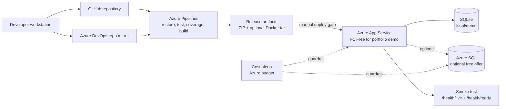

# Operations Runbook

## Purpose

This runbook explains how TodoApp is built, packaged, deployed, validated, and
rolled back. It is intended for Azure App Service deployments from Azure
DevOps, while keeping local development and portfolio review simple.

## Release Flow

1. Open a feature branch from the latest accepted development branch.
2. Run the local checks before opening a pull request.
3. Let Azure Pipelines restore, test, build, and package the application.
4. Review the pipeline artifacts and test coverage.
5. Merge only after CI is green.
6. Manually run the pipeline with `deployToAzure` set to `true` for deployment.
7. Run the smoke test against the deployed App Service URL.

## Deployment Architecture



## Local Verification

```powershell
dotnet restore TodoApp.sln
dotnet build TodoApp.sln --configuration Release --no-restore
dotnet test TodoApp.sln --configuration Release --no-build --collect:"XPlat Code Coverage"

Push-Location src/TodoApp.Web
npm ci
npm run test
npm run build
Pop-Location

docker build -t todoapp:local .
```

Docker can be skipped on machines where it is not installed. CI still contains
the Docker build step so container readiness can be validated later.

## Environment Configuration

| Setting | Purpose | Secret |
| --- | --- | --- |
| `ConnectionStrings__TodoApp` | Database connection string | Yes |
| `Database__Provider` | `Sqlite` for local or `SqlServer` for Azure SQL | No |
| `Authentication__Authority` | JWT issuer authority | No |
| `Authentication__Audience` | Expected JWT audience | No |
| `ASPNETCORE_ENVIRONMENT` | Runtime environment name | No |
| `ASPNETCORE_URLS` | Container listen address | No |

Secrets must be stored in Azure DevOps variable groups, Azure App Service
configuration, or Azure Key Vault. They must not be committed to the repository.

## Cost-Conscious Azure Hosting

For portfolio demonstrations, prefer the lowest-cost setup first:

- Use the App Service F1 Free tier for development and portfolio review only.
- Keep deployment manually gated in Azure Pipelines.
- Leave Always On disabled on free/shared hosting tiers.
- Configure Azure Cost Management budgets and alerts before deploying.
- Use SQLite locally until Azure SQL is genuinely needed.
- If testing Azure SQL, use the free Azure SQL Database offer where available
  and keep usage within the monthly allowance.
- Delete or stop paid resources when the portfolio review period ends.

Docker is not required to run Azure App Service from the published ZIP package.
The Docker build remains in CI as a production-readiness validation and can be
used later if the app moves to container hosting.

See the [Azure setup checklist](AZURE_SETUP.md) for the App Service, optional
Azure SQL, service connection, variables, smoke test, and budget-alert steps.

## Azure Pipeline Variables

| Variable | Description |
| --- | --- |
| `azureServiceConnection` | Azure DevOps service connection name |
| `webAppName` | Target Azure Linux App Service name |
| `smokeTestBaseUrl` | Optional deployed app URL used after deployment |

The deployment stage is protected by the `deployToAzure` pipeline parameter.
Keep it `false` for normal pull-request validation.

## Smoke Test

Run the smoke test after local publish, container start, or Azure deployment:

```powershell
powershell -ExecutionPolicy Bypass -File ./scripts/SmokeTest.ps1 `
  -BaseUrl "https://your-app.azurewebsites.net"
```

The script checks:

- `/health/live` for process availability.
- `/health/ready` for dependency readiness.

## Rollback

1. Identify the last successful pipeline run.
2. Redeploy the previous `drop` artifact from Azure DevOps.
3. If the database schema changed, inspect the migration impact before
   rollback.
4. Run the smoke test after redeployment.
5. Record the incident and follow-up fix in the pull request or issue tracker.

## Operational Checks

- `/health/live` should return success when the process is running.
- `/health/ready` should return success only when required dependencies are
  reachable.
- Responses include correlation IDs for log tracing.
- Application logs should be reviewed after deployment for authentication,
  database, or startup errors.
